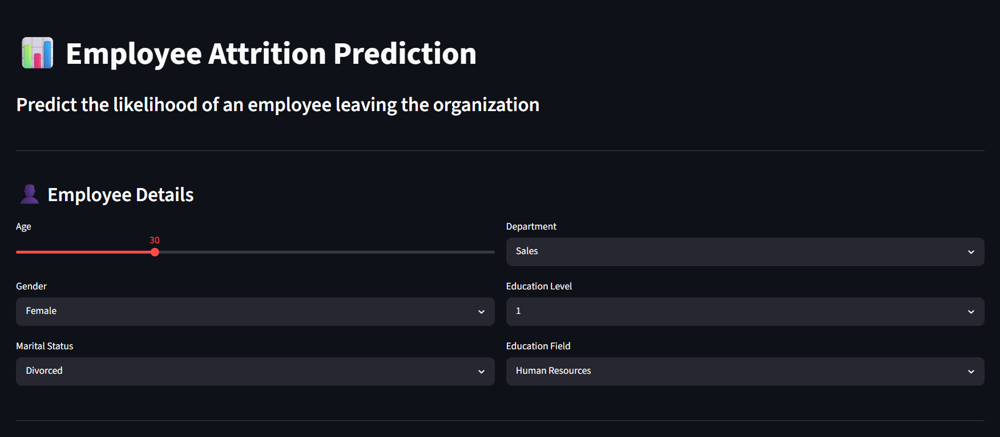
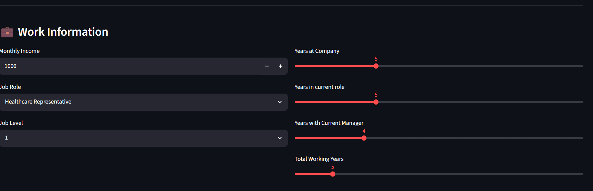
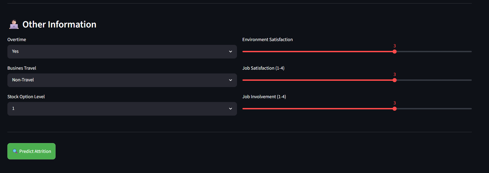
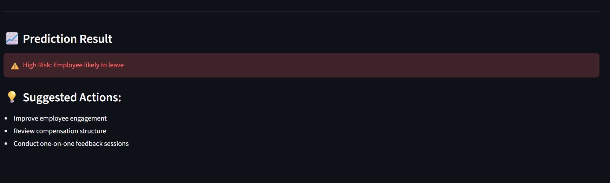
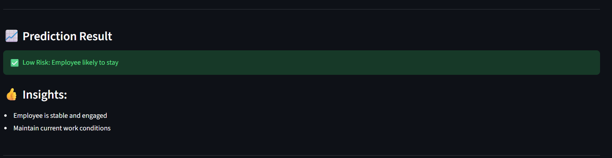

# Employee Attrition Prediction | End-to-End ML Application

An end-to-end Machine Learning application demonstrating model development, automated testing, containerization, CI/CD, and cloud deployment using AWS.

[](https://github.com/ssandhya1184/ml-aws-docker-app/actions/workflows/ci.yml)




An end-to-end ML application built with Scikit-learn, Streamlit, Docker, and AWS.
## Project Overview

This project demonstrates how a Machine Learning model can be transformed into a production-style application.

Starting with a Random Forest model for employee attrition prediction, the project was progressively enhanced into an end-to-end solution by incorporating:

- Data preprocessing pipelines
- Interactive Streamlit user interface
- Docker containerization
- AWS deployment using Amazon EC2 and Amazon ECR
- GitHub Actions based CI/CD pipeline
- Automated testing using pytest

The objective of this project is not only to build an accurate prediction model, but also to demonstrate the software engineering practices involved in developing, testing and deploying Machine Learning applications.

## Architecture

```text
 Dataset
      │
      ▼
Model Training
      │
      ▼
Serialized Pipeline (Joblib)
      │
      ▼
Streamlit Application
      │
      ▼
Docker Container
      │
      ▼
GitHub Actions (CI)
      │
      ▼
Amazon ECR
      │
      ▼
Amazon EC2
```

## Features
- Interactive Streamlit interface
- Automatic preprocessing using Scikit-learn Pipeline
- One-Hot Encoding
- Standard Scaling
- Missing value handling
- SMOTE oversampling for class imbalance
- Probability-based prediction threshold (0.30)
- Docker containerization
- AWS deployment using Amazon EC2 and Amazon ECR
- Automated testing with pytest
- GitHub Actions based CI/CD pipeline

## Technologies
- Python
- Scikit-learn
- Pandas
- NumPy
- Imbalanced-learn
- Streamlit
- Docker
- GitHub Actions
- pytest
- AWS EC2
- Amazon ECR
- uv Package Manager

## Model Pipeline
```text
Raw User Input
     ↓
Column Transformer
     ↓
StandardScaler
     ↓
OneHotEncoder
     ↓
   SMOTE
     ↓
Random Forest
     ↓
Probability Prediction
     ↓
Threshold = 0.30
     ↓
Employee Attrition Prediction
```

## Steps to run locally
uv sync

uv run streamlit run src/app/streamlit_app.py

## Docker
docker build -t ml-app .

docker run -p 8501:8501 ml-app

## AWS Deployment
```text
Docker Image
     ↓
Amazon ECR
     ↓
Amazon EC2
     ↓
Streamlit Application
```

## CI/CD Pipeline

The project uses GitHub Actions to automate validation and deployment tasks.

### Continuous Integration (CI)

Every push to the `main` branch automatically performs:

- Checkout repository
- Setup Python environment
- Install dependencies using `uv`
- Execute automated tests using `pytest`
- Validate Docker image build

### Continuous Delivery (CD)

Deployment is intentionally triggered manually using GitHub Actions.

The deployment workflow:

- Authenticates with AWS using GitHub Secrets
- Logs in to Amazon ECR
- Builds the Docker image
- Tags the image for Amazon ECR
- Pushes the latest image to Amazon ECR

This separation ensures that every code change is automatically validated, while deployment occurs only when a release is intentionally triggered.

## Automated Testing

The project includes automated tests using `pytest`.

Current test coverage includes:

- Model artifact loading
- Prediction pipeline validation

The test suite is automatically executed through the GitHub Actions CI workflow before every Docker image build.

## Future Enhancements

- Add test coverage reporting using `pytest-cov`
- Integrate SonarQube for code quality analysis
- Add dependency vulnerability scanning
- Automate EC2 deployment from GitHub Actions
- Introduce model versioning and experiment tracking using MLflow

# Application Screenshots

## Home Page


---


---


---

## High Risk Prediction



---

## Low Risk Prediction

